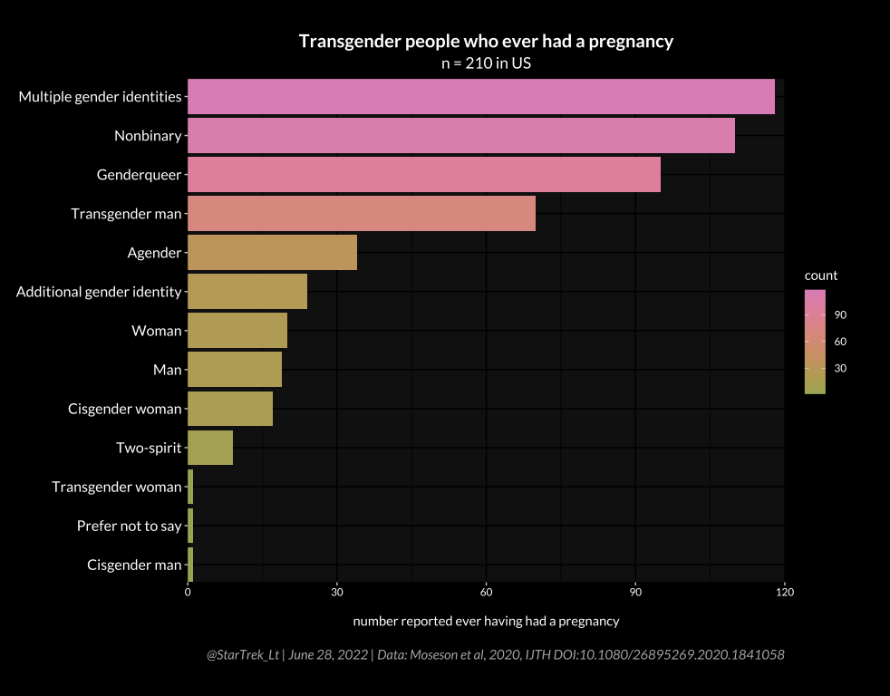

# LGBT Research papers

Research papers that are about LGBT issues for data science projects.

> Heidi Moseson, Laura Fix, Jen Hastings, Ari Stoeffler, Mitchell R. Lunn, Annesa Flentje, Micah E. Lubensky, Matthew R. Capriotti, Sachiko Ragosta, Hannah Forsberg & Juno Obedin-Maliver (2021) Pregnancy intentions and outcomes among transgender, nonbinary, and gender-expansive people assigned female or intersex at birth in the United States: Results from a national, quantitative survey, International Journal of Transgender Health, 22:1-2, 30-41, DOI: 10.1080/26895269.2020.1841058